The goal of this exercise is to predict if the Titanic passengers in the test set survived. I have used Stacking to train my model. Stacking is an ensemble technique where predictions from multiple models are used to generate a second level model called meta-model. This second-layer algorithm is trained to optimally combine the model predictions to form a new set of predictions. There are many good resources online that explain this concept in detail.

In this kernel, I have tried multiple classification algorithms and used cross validation score to pick the 5 best models. These 5 models are called base models. The predictions from these base models serve as the input to the second-level model called the meta-model. I used Random Forest for fitting my meta-model. To predict the results, I used the base models to generate first-level predictions on test set. These first level predictions from the base models were used as the input to the meta model. 

This kernel is a combination of multiple approaches that I have learned through various online courses and books.  

First, we will import the libraries: 


```python
import pandas as pd
import numpy as np
import matplotlib.pyplot as plt
import seaborn as sns
%matplotlib inline
from sklearn.ensemble import (RandomForestClassifier, AdaBoostClassifier, 
                              GradientBoostingClassifier, ExtraTreesClassifier)
```


```python
train = pd.read_csv('train.csv')
test = pd.read_csv('test.csv')
```


```python
train.head()
```


<div>
<style scoped>
    .dataframe tbody tr th:only-of-type {
        vertical-align: middle;
    }

    .dataframe tbody tr th {
        vertical-align: top;
    }

    .dataframe thead th {
        text-align: right;
    }
</style>
<table border="1" class="dataframe">
  <thead>
    <tr style="text-align: right;">
      <th></th>
      <th>PassengerId</th>
      <th>Survived</th>
      <th>Pclass</th>
      <th>Name</th>
      <th>Sex</th>
      <th>Age</th>
      <th>SibSp</th>
      <th>Parch</th>
      <th>Ticket</th>
      <th>Fare</th>
      <th>Cabin</th>
      <th>Embarked</th>
    </tr>
  </thead>
  <tbody>
    <tr>
      <th>0</th>
      <td>1</td>
      <td>0</td>
      <td>3</td>
      <td>Braund, Mr. Owen Harris</td>
      <td>male</td>
      <td>22.0</td>
      <td>1</td>
      <td>0</td>
      <td>A/5 21171</td>
      <td>7.2500</td>
      <td>NaN</td>
      <td>S</td>
    </tr>
    <tr>
      <th>1</th>
      <td>2</td>
      <td>1</td>
      <td>1</td>
      <td>Cumings, Mrs. John Bradley (Florence Briggs Th...</td>
      <td>female</td>
      <td>38.0</td>
      <td>1</td>
      <td>0</td>
      <td>PC 17599</td>
      <td>71.2833</td>
      <td>C85</td>
      <td>C</td>
    </tr>
    <tr>
      <th>2</th>
      <td>3</td>
      <td>1</td>
      <td>3</td>
      <td>Heikkinen, Miss. Laina</td>
      <td>female</td>
      <td>26.0</td>
      <td>0</td>
      <td>0</td>
      <td>STON/O2. 3101282</td>
      <td>7.9250</td>
      <td>NaN</td>
      <td>S</td>
    </tr>
    <tr>
      <th>3</th>
      <td>4</td>
      <td>1</td>
      <td>1</td>
      <td>Futrelle, Mrs. Jacques Heath (Lily May Peel)</td>
      <td>female</td>
      <td>35.0</td>
      <td>1</td>
      <td>0</td>
      <td>113803</td>
      <td>53.1000</td>
      <td>C123</td>
      <td>S</td>
    </tr>
    <tr>
      <th>4</th>
      <td>5</td>
      <td>0</td>
      <td>3</td>
      <td>Allen, Mr. William Henry</td>
      <td>male</td>
      <td>35.0</td>
      <td>0</td>
      <td>0</td>
      <td>373450</td>
      <td>8.0500</td>
      <td>NaN</td>
      <td>S</td>
    </tr>
  </tbody>
</table>
</div>


```python
train.tail()
```


<div>
<style scoped>
    .dataframe tbody tr th:only-of-type {
        vertical-align: middle;
    }

    .dataframe tbody tr th {
        vertical-align: top;
    }

    .dataframe thead th {
        text-align: right;
    }
</style>
<table border="1" class="dataframe">
  <thead>
    <tr style="text-align: right;">
      <th></th>
      <th>PassengerId</th>
      <th>Survived</th>
      <th>Pclass</th>
      <th>Name</th>
      <th>Sex</th>
      <th>Age</th>
      <th>SibSp</th>
      <th>Parch</th>
      <th>Ticket</th>
      <th>Fare</th>
      <th>Cabin</th>
      <th>Embarked</th>
    </tr>
  </thead>
  <tbody>
    <tr>
      <th>886</th>
      <td>887</td>
      <td>0</td>
      <td>2</td>
      <td>Montvila, Rev. Juozas</td>
      <td>male</td>
      <td>27.0</td>
      <td>0</td>
      <td>0</td>
      <td>211536</td>
      <td>13.00</td>
      <td>NaN</td>
      <td>S</td>
    </tr>
    <tr>
      <th>887</th>
      <td>888</td>
      <td>1</td>
      <td>1</td>
      <td>Graham, Miss. Margaret Edith</td>
      <td>female</td>
      <td>19.0</td>
      <td>0</td>
      <td>0</td>
      <td>112053</td>
      <td>30.00</td>
      <td>B42</td>
      <td>S</td>
    </tr>
    <tr>
      <th>888</th>
      <td>889</td>
      <td>0</td>
      <td>3</td>
      <td>Johnston, Miss. Catherine Helen "Carrie"</td>
      <td>female</td>
      <td>NaN</td>
      <td>1</td>
      <td>2</td>
      <td>W./C. 6607</td>
      <td>23.45</td>
      <td>NaN</td>
      <td>S</td>
    </tr>
    <tr>
      <th>889</th>
      <td>890</td>
      <td>1</td>
      <td>1</td>
      <td>Behr, Mr. Karl Howell</td>
      <td>male</td>
      <td>26.0</td>
      <td>0</td>
      <td>0</td>
      <td>111369</td>
      <td>30.00</td>
      <td>C148</td>
      <td>C</td>
    </tr>
    <tr>
      <th>890</th>
      <td>891</td>
      <td>0</td>
      <td>3</td>
      <td>Dooley, Mr. Patrick</td>
      <td>male</td>
      <td>32.0</td>
      <td>0</td>
      <td>0</td>
      <td>370376</td>
      <td>7.75</td>
      <td>NaN</td>
      <td>Q</td>
    </tr>
  </tbody>
</table>
</div>


```python
train.describe()
```


<div>
<style scoped>
    .dataframe tbody tr th:only-of-type {
        vertical-align: middle;
    }

    .dataframe tbody tr th {
        vertical-align: top;
    }

    .dataframe thead th {
        text-align: right;
    }
</style>
<table border="1" class="dataframe">
  <thead>
    <tr style="text-align: right;">
      <th></th>
      <th>PassengerId</th>
      <th>Survived</th>
      <th>Pclass</th>
      <th>Age</th>
      <th>SibSp</th>
      <th>Parch</th>
      <th>Fare</th>
    </tr>
  </thead>
  <tbody>
    <tr>
      <th>count</th>
      <td>891.000000</td>
      <td>891.000000</td>
      <td>891.000000</td>
      <td>714.000000</td>
      <td>891.000000</td>
      <td>891.000000</td>
      <td>891.000000</td>
    </tr>
    <tr>
      <th>mean</th>
      <td>446.000000</td>
      <td>0.383838</td>
      <td>2.308642</td>
      <td>29.699118</td>
      <td>0.523008</td>
      <td>0.381594</td>
      <td>32.204208</td>
    </tr>
    <tr>
      <th>std</th>
      <td>257.353842</td>
      <td>0.486592</td>
      <td>0.836071</td>
      <td>14.526497</td>
      <td>1.102743</td>
      <td>0.806057</td>
      <td>49.693429</td>
    </tr>
    <tr>
      <th>min</th>
      <td>1.000000</td>
      <td>0.000000</td>
      <td>1.000000</td>
      <td>0.420000</td>
      <td>0.000000</td>
      <td>0.000000</td>
      <td>0.000000</td>
    </tr>
    <tr>
      <th>25%</th>
      <td>223.500000</td>
      <td>0.000000</td>
      <td>2.000000</td>
      <td>20.125000</td>
      <td>0.000000</td>
      <td>0.000000</td>
      <td>7.910400</td>
    </tr>
    <tr>
      <th>50%</th>
      <td>446.000000</td>
      <td>0.000000</td>
      <td>3.000000</td>
      <td>28.000000</td>
      <td>0.000000</td>
      <td>0.000000</td>
      <td>14.454200</td>
    </tr>
    <tr>
      <th>75%</th>
      <td>668.500000</td>
      <td>1.000000</td>
      <td>3.000000</td>
      <td>38.000000</td>
      <td>1.000000</td>
      <td>0.000000</td>
      <td>31.000000</td>
    </tr>
    <tr>
      <th>max</th>
      <td>891.000000</td>
      <td>1.000000</td>
      <td>3.000000</td>
      <td>80.000000</td>
      <td>8.000000</td>
      <td>6.000000</td>
      <td>512.329200</td>
    </tr>
  </tbody>
</table>
</div>


```python
train.info()
```

    <class 'pandas.core.frame.DataFrame'>
    RangeIndex: 891 entries, 0 to 890
    Data columns (total 12 columns):
    PassengerId    891 non-null int64
    Survived       891 non-null int64
    Pclass         891 non-null int64
    Name           891 non-null object
    Sex            891 non-null object
    Age            714 non-null float64
    SibSp          891 non-null int64
    Parch          891 non-null int64
    Ticket         891 non-null object
    Fare           891 non-null float64
    Cabin          204 non-null object
    Embarked       889 non-null object
    dtypes: float64(2), int64(5), object(5)
    memory usage: 83.6+ KB
    


```python
len(train)
```


    891


```python
len(test)
```


    418


### Missing Values


```python
print(train.isnull().sum())
```

    PassengerId      0
    Survived         0
    Pclass           0
    Name             0
    Sex              0
    Age            177
    SibSp            0
    Parch            0
    Ticket           0
    Fare             0
    Cabin          687
    Embarked         2
    dtype: int64
    


```python
print(test.isnull().sum())
```

    PassengerId      0
    Pclass           0
    Name             0
    Sex              0
    Age             86
    SibSp            0
    Parch            0
    Ticket           0
    Fare             1
    Cabin          327
    Embarked         0
    dtype: int64
    


```python
plt.figure(figsize=(12,5))
sns.heatmap(train.isnull(),yticklabels=False,cbar=False,cmap='viridis')
```


    <matplotlib.axes._subplots.AxesSubplot at 0x2683e1f8940>


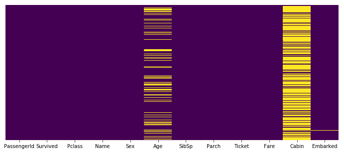


```python
plt.figure(figsize=(12,5))
sns.heatmap(test.isnull(),yticklabels=False,cbar=False,cmap='viridis')
```


    <matplotlib.axes._subplots.AxesSubplot at 0x2683e249978>


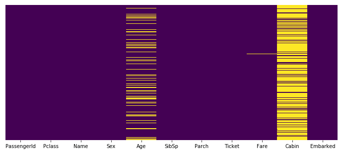


### Impute Missing Values

Age and Cabin columns contain many missing values. 77% of the observations for Cabin do not contain a value. ML algorithms will not be able to handle such a large number of missing values. We will drop the Cabin column.


```python
train.drop(['Cabin'], axis =1, inplace=True)
test.drop(['Cabin'], axis = 1, inplace=True)
```


```python
combined = pd.concat([train,test])
```


```python
sns.heatmap(combined.corr(),annot=True)
```


    <matplotlib.axes._subplots.AxesSubplot at 0x2683e1f39e8>


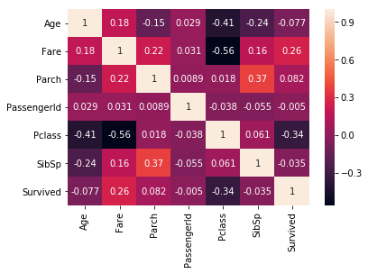


There is a good correlation between Age and PClass. I will use PClass value to impute Age, where it is misisng.


```python
combined.groupby('Pclass').mean()['Age']
```


    Pclass
    1    39.159930
    2    29.506705
    3    24.816367
    Name: Age, dtype: float64


```python
def setAge(cols):
    age = cols[0]
    pclass = cols[1]
    if pd.isnull(age):
        if pclass == 1:
            return 39
        elif pclass == 2:
            return 30
        else:
            return 25
    else:
        return age
```


```python
train['Age'] = train[['Age','Pclass']].apply(setAge,axis=1)
test['Age'] = test[['Age','Pclass']].apply(setAge,axis=1)

combined['Embarked'].value_counts()
```


    S    914
    C    270
    Q    123
    Name: Embarked, dtype: int64


As Southampton is the most common value for port emabrked, I will replace the misisng values with 'S'


```python
train['Embarked'] = train['Embarked'].replace(np.NaN, 'S') 
test['Embarked'] = test['Embarked'].replace(np.NaN, 'S') 
    
```

There is one observation in the Train data set that is misisng Fare information. I will set the value based on the mean  of 3rd class fare.


```python
combined.groupby('Pclass').mean()['Fare']
```


    Pclass
    1    87.508992
    2    21.179196
    3    13.302889
    Name: Fare, dtype: float64


```python
test[test['Fare'].isnull()]
```


<div>
<style scoped>
    .dataframe tbody tr th:only-of-type {
        vertical-align: middle;
    }

    .dataframe tbody tr th {
        vertical-align: top;
    }

    .dataframe thead th {
        text-align: right;
    }
</style>
<table border="1" class="dataframe">
  <thead>
    <tr style="text-align: right;">
      <th></th>
      <th>PassengerId</th>
      <th>Pclass</th>
      <th>Name</th>
      <th>Sex</th>
      <th>Age</th>
      <th>SibSp</th>
      <th>Parch</th>
      <th>Ticket</th>
      <th>Fare</th>
      <th>Embarked</th>
    </tr>
  </thead>
  <tbody>
    <tr>
      <th>152</th>
      <td>1044</td>
      <td>3</td>
      <td>Storey, Mr. Thomas</td>
      <td>male</td>
      <td>60.5</td>
      <td>0</td>
      <td>0</td>
      <td>3701</td>
      <td>NaN</td>
      <td>S</td>
    </tr>
  </tbody>
</table>
</div>


```python
test["Fare"].fillna(13.30, inplace=True)
print(train.isnull().sum())
```

    PassengerId    0
    Survived       0
    Pclass         0
    Name           0
    Sex            0
    Age            0
    SibSp          0
    Parch          0
    Ticket         0
    Fare           0
    Embarked       0
    dtype: int64
    


```python
print(test.isnull().sum())
```

    PassengerId    0
    Pclass         0
    Name           0
    Sex            0
    Age            0
    SibSp          0
    Parch          0
    Ticket         0
    Fare           0
    Embarked       0
    dtype: int64
    

The above steps resolve all the missing values. We no longer have any missing values.

## EDA & Feature Engineering

This is my favorite phase of any data science project. I feel it is important to analyze all variables in the data set. Most of my analysis is limited to the target variable 'Survived' but I have included some analysis on relationsips between other columns. 

### Sex


```python
sns.countplot(train['Survived'],palette= {1: "#1ab188", 0: "#c22250"})
```


    <matplotlib.axes._subplots.AxesSubplot at 0x2683e1f3780>


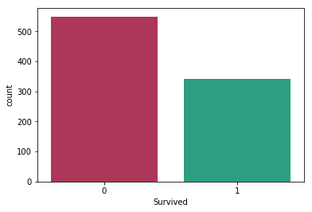


```python
sns.barplot(data=train,x='Sex',y='Survived',palette= {'male': "#3498db", 'female': "#ffe1ff"})
```


    <matplotlib.axes._subplots.AxesSubplot at 0x2683e400240>


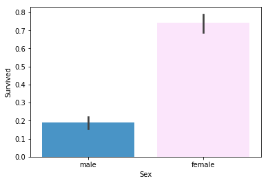


```python
#Sex
sns.countplot(data=train,x='Sex',hue='Survived',palette= {1: "#1ab188", 0: "#c22250"})
```


    <matplotlib.axes._subplots.AxesSubplot at 0x2683e44bb38>


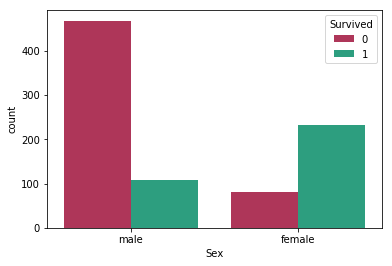


### Parch, SibSp and Family Size


```python
sns.barplot(data=train,x='Parch',y='Survived')
```


    <matplotlib.axes._subplots.AxesSubplot at 0x2683e3a5ac8>


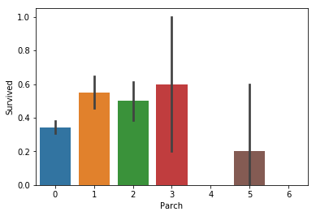


```python
sns.barplot(data=train,x='SibSp',y='Survived')
```


    <matplotlib.axes._subplots.AxesSubplot at 0x2683e49a710>


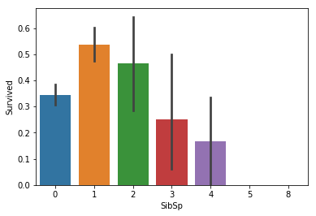


As the SibSp and Parch columns are not very different, I will combine them into a single column called Family Size


```python
train['FamilySize'] = train['SibSp'] + train ['Parch']
test['FamilySize'] = test['SibSp'] + test ['Parch']

sns.barplot(data=train,x='FamilySize',y='Survived')
```


    <matplotlib.axes._subplots.AxesSubplot at 0x2683e5915f8>


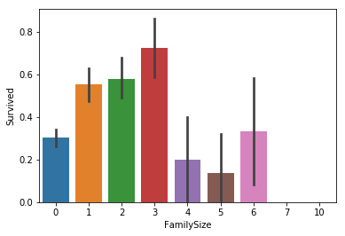


Survival probability is low for single travelers. So I will create a column to identify the solo travellers.


```python
def isAlone(cols):
    if (cols[0]==0) & (cols[1]==0):
        return 1
    else:
        return 0
train['IsAlone'] = train[['SibSp','Parch']].apply(isAlone,axis=1)
test['IsAlone'] = test[['SibSp','Parch']].apply(isAlone,axis=1)

sns.barplot(data=train,x='IsAlone',y='Survived')
```


    <matplotlib.axes._subplots.AxesSubplot at 0x2683e617c50>


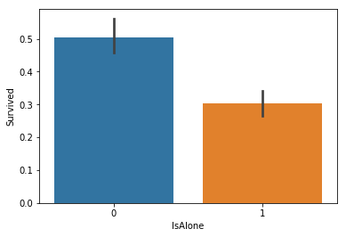


```python
sns.countplot(data=train,x='IsAlone',hue='Survived',palette= {1: "#1ab188", 0: "#c22250"})
```


    <matplotlib.axes._subplots.AxesSubplot at 0x2683e6447b8>


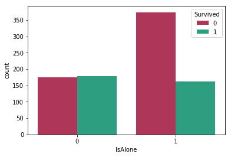


```python
#sns.countplot(data=train,x='Sex',hue='IsAlone')
combined = pd.concat([train,test])
sns.countplot(data=combined,x='Sex',hue='IsAlone')
```


    <matplotlib.axes._subplots.AxesSubplot at 0x2683e6bcb70>


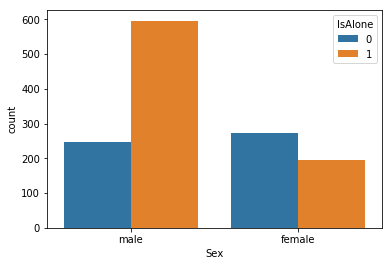


### Age


```python
f = sns.FacetGrid(combined,hue='IsAlone',size=5,aspect=4)
f.map(sns.kdeplot,'Age',shade= True)
f.add_legend()
```


    <seaborn.axisgrid.FacetGrid at 0x2683e696208>


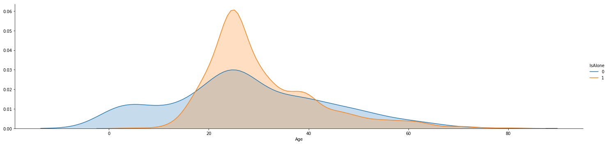


```python
combined[(combined['IsAlone'] == True)].sort_values(['Age']).head()
```


<div>
<style scoped>
    .dataframe tbody tr th:only-of-type {
        vertical-align: middle;
    }

    .dataframe tbody tr th {
        vertical-align: top;
    }

    .dataframe thead th {
        text-align: right;
    }
</style>
<table border="1" class="dataframe">
  <thead>
    <tr style="text-align: right;">
      <th></th>
      <th>Age</th>
      <th>Embarked</th>
      <th>FamilySize</th>
      <th>Fare</th>
      <th>IsAlone</th>
      <th>Name</th>
      <th>Parch</th>
      <th>PassengerId</th>
      <th>Pclass</th>
      <th>Sex</th>
      <th>SibSp</th>
      <th>Survived</th>
      <th>Ticket</th>
    </tr>
  </thead>
  <tbody>
    <tr>
      <th>777</th>
      <td>5.0</td>
      <td>S</td>
      <td>0</td>
      <td>12.4750</td>
      <td>1</td>
      <td>Emanuel, Miss. Virginia Ethel</td>
      <td>0</td>
      <td>778</td>
      <td>3</td>
      <td>female</td>
      <td>0</td>
      <td>1.0</td>
      <td>364516</td>
    </tr>
    <tr>
      <th>731</th>
      <td>11.0</td>
      <td>C</td>
      <td>0</td>
      <td>18.7875</td>
      <td>1</td>
      <td>Hassan, Mr. Houssein G N</td>
      <td>0</td>
      <td>732</td>
      <td>3</td>
      <td>male</td>
      <td>0</td>
      <td>0.0</td>
      <td>2699</td>
    </tr>
    <tr>
      <th>120</th>
      <td>12.0</td>
      <td>S</td>
      <td>0</td>
      <td>15.7500</td>
      <td>1</td>
      <td>Watt, Miss. Bertha J</td>
      <td>0</td>
      <td>1012</td>
      <td>2</td>
      <td>female</td>
      <td>0</td>
      <td>NaN</td>
      <td>C.A. 33595</td>
    </tr>
    <tr>
      <th>780</th>
      <td>13.0</td>
      <td>C</td>
      <td>0</td>
      <td>7.2292</td>
      <td>1</td>
      <td>Ayoub, Miss. Banoura</td>
      <td>0</td>
      <td>781</td>
      <td>3</td>
      <td>female</td>
      <td>0</td>
      <td>1.0</td>
      <td>2687</td>
    </tr>
    <tr>
      <th>14</th>
      <td>14.0</td>
      <td>S</td>
      <td>0</td>
      <td>7.8542</td>
      <td>1</td>
      <td>Vestrom, Miss. Hulda Amanda Adolfina</td>
      <td>0</td>
      <td>15</td>
      <td>3</td>
      <td>female</td>
      <td>0</td>
      <td>0.0</td>
      <td>350406</td>
    </tr>
  </tbody>
</table>
</div>


The 2 plots above may not be of much significance to this challenge but I find them interesting. We observe that most female travelers had a family member travelling with them. Most of the travelers sailing alone were in the age group of 17-40. The youngest solo traveler was just 5 years and she survived. This piqued my curiosity and I found that she was travelling with a nursemaid. More information about Virginia Ethel: https://www.encyclopedia-titanica.org/titanic-survivor/virginia-ethel-emanuel.html. 
The second youngest solo traveler was not that fortunate. He was travelling with a relative. That's it for now, lets continue with the challenge.


```python
sns.distplot(train['Age'].dropna(),kde=False,bins=60)
```


    <matplotlib.axes._subplots.AxesSubplot at 0x2683f947240>


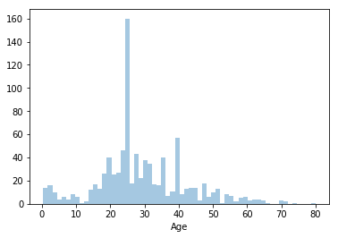


```python
f = sns.FacetGrid(train,hue='Survived',size=5,aspect=4)
f.map(sns.kdeplot,'Age',shade= True)
f.add_legend()
```


    <seaborn.axisgrid.FacetGrid at 0x2683f9d66a0>


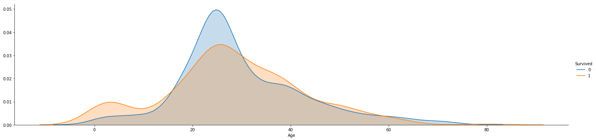


### P Class and Fare

The chance of survival increased with class. Around 60% of first class passengers survived.Only 23% of third class passengers survived.


```python
sns.barplot(data=train,x='Pclass',y='Survived',palette= {1: "#117A65", 2: "#52BE80",3: "#ABEBC6"})
```


    <matplotlib.axes._subplots.AxesSubplot at 0x2683fa3b9e8>


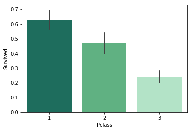


```python
f = sns.FacetGrid(combined,hue='Pclass',size=5,aspect=4)
f.map(sns.kdeplot,'Age',shade= True)
f.add_legend()
```


    <seaborn.axisgrid.FacetGrid at 0x2683faabe48>


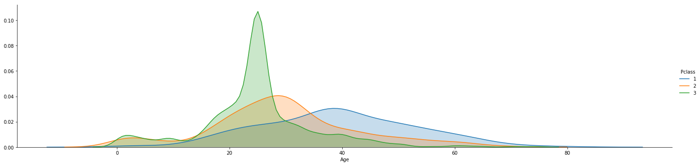


This above graph is interesting but expected. 


```python
f = sns.FacetGrid(combined,hue='Pclass',size=5,aspect=4)
plt.xlim(0, 300)
f.map(sns.kdeplot,'Fare',shade= True)
f.add_legend()
```


    <seaborn.axisgrid.FacetGrid at 0x2683fb5db38>


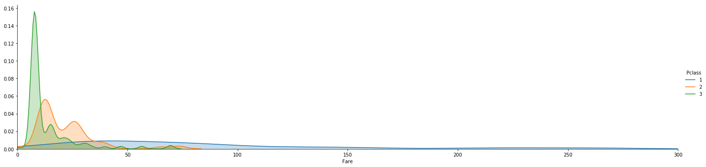


```python
f = sns.FacetGrid(combined,hue='Pclass',size=5,aspect=4)
plt.xlim(0, 50)
f.map(sns.kdeplot,'Fare',shade= True)
f.add_legend()
```


    <seaborn.axisgrid.FacetGrid at 0x26840620d68>


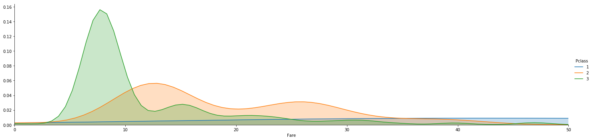


```python
plt.figure(figsize=(12,5))
combined['FareBucket'] = (combined['Fare']/50).astype(int)*50
sns.countplot(data=combined,x='FareBucket',hue='Pclass',palette= {1: "#117A65", 2: "#52BE80",3: "#ABEBC6"})
```


    <matplotlib.axes._subplots.AxesSubplot at 0x26840b07da0>


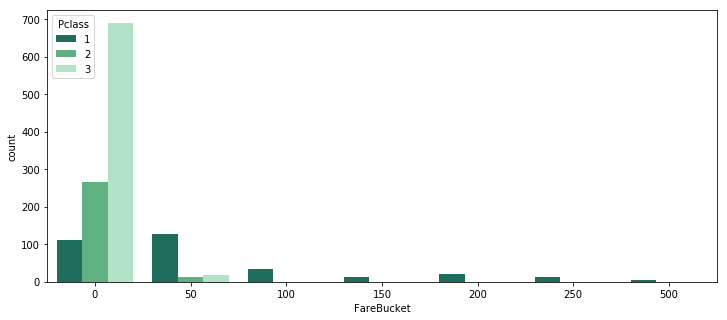


```python
combined[combined['Pclass']==1].sort_values('Fare').head()
```


<div>
<style scoped>
    .dataframe tbody tr th:only-of-type {
        vertical-align: middle;
    }

    .dataframe tbody tr th {
        vertical-align: top;
    }

    .dataframe thead th {
        text-align: right;
    }
</style>
<table border="1" class="dataframe">
  <thead>
    <tr style="text-align: right;">
      <th></th>
      <th>Age</th>
      <th>Embarked</th>
      <th>FamilySize</th>
      <th>Fare</th>
      <th>IsAlone</th>
      <th>Name</th>
      <th>Parch</th>
      <th>PassengerId</th>
      <th>Pclass</th>
      <th>Sex</th>
      <th>SibSp</th>
      <th>Survived</th>
      <th>Ticket</th>
      <th>FareBucket</th>
    </tr>
  </thead>
  <tbody>
    <tr>
      <th>822</th>
      <td>38.0</td>
      <td>S</td>
      <td>0</td>
      <td>0.0</td>
      <td>1</td>
      <td>Reuchlin, Jonkheer. John George</td>
      <td>0</td>
      <td>823</td>
      <td>1</td>
      <td>male</td>
      <td>0</td>
      <td>0.0</td>
      <td>19972</td>
      <td>0</td>
    </tr>
    <tr>
      <th>815</th>
      <td>39.0</td>
      <td>S</td>
      <td>0</td>
      <td>0.0</td>
      <td>1</td>
      <td>Fry, Mr. Richard</td>
      <td>0</td>
      <td>816</td>
      <td>1</td>
      <td>male</td>
      <td>0</td>
      <td>0.0</td>
      <td>112058</td>
      <td>0</td>
    </tr>
    <tr>
      <th>263</th>
      <td>40.0</td>
      <td>S</td>
      <td>0</td>
      <td>0.0</td>
      <td>1</td>
      <td>Harrison, Mr. William</td>
      <td>0</td>
      <td>264</td>
      <td>1</td>
      <td>male</td>
      <td>0</td>
      <td>0.0</td>
      <td>112059</td>
      <td>0</td>
    </tr>
    <tr>
      <th>266</th>
      <td>39.0</td>
      <td>S</td>
      <td>0</td>
      <td>0.0</td>
      <td>1</td>
      <td>Chisholm, Mr. Roderick Robert Crispin</td>
      <td>0</td>
      <td>1158</td>
      <td>1</td>
      <td>male</td>
      <td>0</td>
      <td>NaN</td>
      <td>112051</td>
      <td>0</td>
    </tr>
    <tr>
      <th>633</th>
      <td>39.0</td>
      <td>S</td>
      <td>0</td>
      <td>0.0</td>
      <td>1</td>
      <td>Parr, Mr. William Henry Marsh</td>
      <td>0</td>
      <td>634</td>
      <td>1</td>
      <td>male</td>
      <td>0</td>
      <td>0.0</td>
      <td>112052</td>
      <td>0</td>
    </tr>
  </tbody>
</table>
</div>


I see that a few first class passengers did not pay for their cross atlantic sail. This is interesting. I looked it up and found that many passengers were given complimentary tickets. So let's find the lowest revenue first class ticket.


```python
combined[(combined['Pclass']==1)&(combined['Fare']>0)].sort_values('Fare').head()
```


<div>
<style scoped>
    .dataframe tbody tr th:only-of-type {
        vertical-align: middle;
    }

    .dataframe tbody tr th {
        vertical-align: top;
    }

    .dataframe thead th {
        text-align: right;
    }
</style>
<table border="1" class="dataframe">
  <thead>
    <tr style="text-align: right;">
      <th></th>
      <th>Age</th>
      <th>Embarked</th>
      <th>FamilySize</th>
      <th>Fare</th>
      <th>IsAlone</th>
      <th>Name</th>
      <th>Parch</th>
      <th>PassengerId</th>
      <th>Pclass</th>
      <th>Sex</th>
      <th>SibSp</th>
      <th>Survived</th>
      <th>Ticket</th>
      <th>FareBucket</th>
    </tr>
  </thead>
  <tbody>
    <tr>
      <th>872</th>
      <td>33.0</td>
      <td>S</td>
      <td>0</td>
      <td>5.0000</td>
      <td>1</td>
      <td>Carlsson, Mr. Frans Olof</td>
      <td>0</td>
      <td>873</td>
      <td>1</td>
      <td>male</td>
      <td>0</td>
      <td>0.0</td>
      <td>695</td>
      <td>0</td>
    </tr>
    <tr>
      <th>662</th>
      <td>47.0</td>
      <td>S</td>
      <td>0</td>
      <td>25.5875</td>
      <td>1</td>
      <td>Colley, Mr. Edward Pomeroy</td>
      <td>0</td>
      <td>663</td>
      <td>1</td>
      <td>male</td>
      <td>0</td>
      <td>0.0</td>
      <td>5727</td>
      <td>0</td>
    </tr>
    <tr>
      <th>77</th>
      <td>55.0</td>
      <td>S</td>
      <td>2</td>
      <td>25.7000</td>
      <td>0</td>
      <td>Cornell, Mrs. Robert Clifford (Malvina Helen L...</td>
      <td>0</td>
      <td>969</td>
      <td>1</td>
      <td>female</td>
      <td>2</td>
      <td>NaN</td>
      <td>11770</td>
      <td>0</td>
    </tr>
    <tr>
      <th>205</th>
      <td>39.0</td>
      <td>C</td>
      <td>0</td>
      <td>25.7417</td>
      <td>1</td>
      <td>Omont, Mr. Alfred Fernand</td>
      <td>0</td>
      <td>1097</td>
      <td>1</td>
      <td>male</td>
      <td>0</td>
      <td>NaN</td>
      <td>F.C. 12998</td>
      <td>0</td>
    </tr>
    <tr>
      <th>168</th>
      <td>39.0</td>
      <td>S</td>
      <td>0</td>
      <td>25.9250</td>
      <td>1</td>
      <td>Baumann, Mr. John D</td>
      <td>0</td>
      <td>169</td>
      <td>1</td>
      <td>male</td>
      <td>0</td>
      <td>0.0</td>
      <td>PC 17318</td>
      <td>0</td>
    </tr>
  </tbody>
</table>
</div>


Frans Olof paid just 5 pounds for his first class ticket. The encyclopedia-titanica article about him says that his company bought his ticket. I wish I knew his travel agent. Many first class passengers paid around 25 pounds which is considerably cheaper than the most expensive 3rd class ticket!

I am curious about the most expensive 3rd class ticket. Let's have a look.


```python
combined[combined['Pclass']==3].sort_values('Fare',ascending=False).head(5)
```


<div>
<style scoped>
    .dataframe tbody tr th:only-of-type {
        vertical-align: middle;
    }

    .dataframe tbody tr th {
        vertical-align: top;
    }

    .dataframe thead th {
        text-align: right;
    }
</style>
<table border="1" class="dataframe">
  <thead>
    <tr style="text-align: right;">
      <th></th>
      <th>Age</th>
      <th>Embarked</th>
      <th>FamilySize</th>
      <th>Fare</th>
      <th>IsAlone</th>
      <th>Name</th>
      <th>Parch</th>
      <th>PassengerId</th>
      <th>Pclass</th>
      <th>Sex</th>
      <th>SibSp</th>
      <th>Survived</th>
      <th>Ticket</th>
      <th>FareBucket</th>
    </tr>
  </thead>
  <tbody>
    <tr>
      <th>159</th>
      <td>25.0</td>
      <td>S</td>
      <td>10</td>
      <td>69.55</td>
      <td>0</td>
      <td>Sage, Master. Thomas Henry</td>
      <td>2</td>
      <td>160</td>
      <td>3</td>
      <td>male</td>
      <td>8</td>
      <td>0.0</td>
      <td>CA. 2343</td>
      <td>50</td>
    </tr>
    <tr>
      <th>201</th>
      <td>25.0</td>
      <td>S</td>
      <td>10</td>
      <td>69.55</td>
      <td>0</td>
      <td>Sage, Mr. Frederick</td>
      <td>2</td>
      <td>202</td>
      <td>3</td>
      <td>male</td>
      <td>8</td>
      <td>0.0</td>
      <td>CA. 2343</td>
      <td>50</td>
    </tr>
    <tr>
      <th>846</th>
      <td>25.0</td>
      <td>S</td>
      <td>10</td>
      <td>69.55</td>
      <td>0</td>
      <td>Sage, Mr. Douglas Bullen</td>
      <td>2</td>
      <td>847</td>
      <td>3</td>
      <td>male</td>
      <td>8</td>
      <td>0.0</td>
      <td>CA. 2343</td>
      <td>50</td>
    </tr>
    <tr>
      <th>792</th>
      <td>25.0</td>
      <td>S</td>
      <td>10</td>
      <td>69.55</td>
      <td>0</td>
      <td>Sage, Miss. Stella Anna</td>
      <td>2</td>
      <td>793</td>
      <td>3</td>
      <td>female</td>
      <td>8</td>
      <td>0.0</td>
      <td>CA. 2343</td>
      <td>50</td>
    </tr>
    <tr>
      <th>188</th>
      <td>25.0</td>
      <td>S</td>
      <td>10</td>
      <td>69.55</td>
      <td>0</td>
      <td>Sage, Miss. Ada</td>
      <td>2</td>
      <td>1080</td>
      <td>3</td>
      <td>female</td>
      <td>8</td>
      <td>NaN</td>
      <td>CA. 2343</td>
      <td>50</td>
    </tr>
  </tbody>
</table>
</div>


The highest 3rd class fares are associated with Ticket No CA. 2343. 11 passengers traveled on this ticket and 7 of them died. We do not know the fate of 4 who are the test set. This is unfortunate but reveals a very impotant charateristic about our data. I had ignored the 'Ticket' column till now but I should not ignore it. There is a good chance that they are from the same family. I hope someone from the Sage family survived.


```python
combined[combined['Ticket']=='CA. 2343']
```


<div>
<style scoped>
    .dataframe tbody tr th:only-of-type {
        vertical-align: middle;
    }

    .dataframe tbody tr th {
        vertical-align: top;
    }

    .dataframe thead th {
        text-align: right;
    }
</style>
<table border="1" class="dataframe">
  <thead>
    <tr style="text-align: right;">
      <th></th>
      <th>Age</th>
      <th>Embarked</th>
      <th>FamilySize</th>
      <th>Fare</th>
      <th>IsAlone</th>
      <th>Name</th>
      <th>Parch</th>
      <th>PassengerId</th>
      <th>Pclass</th>
      <th>Sex</th>
      <th>SibSp</th>
      <th>Survived</th>
      <th>Ticket</th>
      <th>FareBucket</th>
    </tr>
  </thead>
  <tbody>
    <tr>
      <th>159</th>
      <td>25.0</td>
      <td>S</td>
      <td>10</td>
      <td>69.55</td>
      <td>0</td>
      <td>Sage, Master. Thomas Henry</td>
      <td>2</td>
      <td>160</td>
      <td>3</td>
      <td>male</td>
      <td>8</td>
      <td>0.0</td>
      <td>CA. 2343</td>
      <td>50</td>
    </tr>
    <tr>
      <th>180</th>
      <td>25.0</td>
      <td>S</td>
      <td>10</td>
      <td>69.55</td>
      <td>0</td>
      <td>Sage, Miss. Constance Gladys</td>
      <td>2</td>
      <td>181</td>
      <td>3</td>
      <td>female</td>
      <td>8</td>
      <td>0.0</td>
      <td>CA. 2343</td>
      <td>50</td>
    </tr>
    <tr>
      <th>201</th>
      <td>25.0</td>
      <td>S</td>
      <td>10</td>
      <td>69.55</td>
      <td>0</td>
      <td>Sage, Mr. Frederick</td>
      <td>2</td>
      <td>202</td>
      <td>3</td>
      <td>male</td>
      <td>8</td>
      <td>0.0</td>
      <td>CA. 2343</td>
      <td>50</td>
    </tr>
    <tr>
      <th>324</th>
      <td>25.0</td>
      <td>S</td>
      <td>10</td>
      <td>69.55</td>
      <td>0</td>
      <td>Sage, Mr. George John Jr</td>
      <td>2</td>
      <td>325</td>
      <td>3</td>
      <td>male</td>
      <td>8</td>
      <td>0.0</td>
      <td>CA. 2343</td>
      <td>50</td>
    </tr>
    <tr>
      <th>792</th>
      <td>25.0</td>
      <td>S</td>
      <td>10</td>
      <td>69.55</td>
      <td>0</td>
      <td>Sage, Miss. Stella Anna</td>
      <td>2</td>
      <td>793</td>
      <td>3</td>
      <td>female</td>
      <td>8</td>
      <td>0.0</td>
      <td>CA. 2343</td>
      <td>50</td>
    </tr>
    <tr>
      <th>846</th>
      <td>25.0</td>
      <td>S</td>
      <td>10</td>
      <td>69.55</td>
      <td>0</td>
      <td>Sage, Mr. Douglas Bullen</td>
      <td>2</td>
      <td>847</td>
      <td>3</td>
      <td>male</td>
      <td>8</td>
      <td>0.0</td>
      <td>CA. 2343</td>
      <td>50</td>
    </tr>
    <tr>
      <th>863</th>
      <td>25.0</td>
      <td>S</td>
      <td>10</td>
      <td>69.55</td>
      <td>0</td>
      <td>Sage, Miss. Dorothy Edith "Dolly"</td>
      <td>2</td>
      <td>864</td>
      <td>3</td>
      <td>female</td>
      <td>8</td>
      <td>0.0</td>
      <td>CA. 2343</td>
      <td>50</td>
    </tr>
    <tr>
      <th>188</th>
      <td>25.0</td>
      <td>S</td>
      <td>10</td>
      <td>69.55</td>
      <td>0</td>
      <td>Sage, Miss. Ada</td>
      <td>2</td>
      <td>1080</td>
      <td>3</td>
      <td>female</td>
      <td>8</td>
      <td>NaN</td>
      <td>CA. 2343</td>
      <td>50</td>
    </tr>
    <tr>
      <th>342</th>
      <td>25.0</td>
      <td>S</td>
      <td>10</td>
      <td>69.55</td>
      <td>0</td>
      <td>Sage, Mr. John George</td>
      <td>9</td>
      <td>1234</td>
      <td>3</td>
      <td>male</td>
      <td>1</td>
      <td>NaN</td>
      <td>CA. 2343</td>
      <td>50</td>
    </tr>
    <tr>
      <th>360</th>
      <td>14.5</td>
      <td>S</td>
      <td>10</td>
      <td>69.55</td>
      <td>0</td>
      <td>Sage, Master. William Henry</td>
      <td>2</td>
      <td>1252</td>
      <td>3</td>
      <td>male</td>
      <td>8</td>
      <td>NaN</td>
      <td>CA. 2343</td>
      <td>50</td>
    </tr>
    <tr>
      <th>365</th>
      <td>25.0</td>
      <td>S</td>
      <td>10</td>
      <td>69.55</td>
      <td>0</td>
      <td>Sage, Mrs. John (Annie Bullen)</td>
      <td>9</td>
      <td>1257</td>
      <td>3</td>
      <td>female</td>
      <td>1</td>
      <td>NaN</td>
      <td>CA. 2343</td>
      <td>50</td>
    </tr>
  </tbody>
</table>
</div>


```python
tst_sageFamily = test[test['Ticket']=='CA. 2343']
tst_sageFamily
```


<div>
<style scoped>
    .dataframe tbody tr th:only-of-type {
        vertical-align: middle;
    }

    .dataframe tbody tr th {
        vertical-align: top;
    }

    .dataframe thead th {
        text-align: right;
    }
</style>
<table border="1" class="dataframe">
  <thead>
    <tr style="text-align: right;">
      <th></th>
      <th>PassengerId</th>
      <th>Pclass</th>
      <th>Name</th>
      <th>Sex</th>
      <th>Age</th>
      <th>SibSp</th>
      <th>Parch</th>
      <th>Ticket</th>
      <th>Fare</th>
      <th>Embarked</th>
      <th>FamilySize</th>
      <th>IsAlone</th>
    </tr>
  </thead>
  <tbody>
    <tr>
      <th>188</th>
      <td>1080</td>
      <td>3</td>
      <td>Sage, Miss. Ada</td>
      <td>female</td>
      <td>25.0</td>
      <td>8</td>
      <td>2</td>
      <td>CA. 2343</td>
      <td>69.55</td>
      <td>S</td>
      <td>10</td>
      <td>0</td>
    </tr>
    <tr>
      <th>342</th>
      <td>1234</td>
      <td>3</td>
      <td>Sage, Mr. John George</td>
      <td>male</td>
      <td>25.0</td>
      <td>1</td>
      <td>9</td>
      <td>CA. 2343</td>
      <td>69.55</td>
      <td>S</td>
      <td>10</td>
      <td>0</td>
    </tr>
    <tr>
      <th>360</th>
      <td>1252</td>
      <td>3</td>
      <td>Sage, Master. William Henry</td>
      <td>male</td>
      <td>14.5</td>
      <td>8</td>
      <td>2</td>
      <td>CA. 2343</td>
      <td>69.55</td>
      <td>S</td>
      <td>10</td>
      <td>0</td>
    </tr>
    <tr>
      <th>365</th>
      <td>1257</td>
      <td>3</td>
      <td>Sage, Mrs. John (Annie Bullen)</td>
      <td>female</td>
      <td>25.0</td>
      <td>1</td>
      <td>9</td>
      <td>CA. 2343</td>
      <td>69.55</td>
      <td>S</td>
      <td>10</td>
      <td>0</td>
    </tr>
  </tbody>
</table>
</div>


I did some researching online for more information about their expensive 3rd class fare but I was not able to find anything concrete. There is a mention of the family changing plans (to sail aboard the Titanic instead of Philadelphia) due to the coal strike. Maybe they ended up buying these expensive tickets due to the late change of plans.

## Ticket Number

There are 40 groups with more than 2 passengers in the trainset. I will create a column called TicSurvProb that will contain the probability of survival of passengers who have these ticket numbers.


```python
ticCount = train.groupby('Ticket')['Sex'].count()
ticSurN = train.groupby('Ticket')['Survived'].sum()
ticCount = pd.DataFrame(ticCount)
ticSurN = pd.DataFrame(ticSurN)
ticSur = ticCount.join(ticSurN)
ticSur['TicSurvProb'] = ticSur['Survived']*(100) /(ticSur['Sex']) 

ticSur.rename(index=str, columns={"Sex": "PassengerCount", "Survived": "PassengersSurvived"},inplace=True)
ticSur.reset_index(level=0, inplace=True)
len(ticSur)
```


    681


```python
ticSur.head()
```


<div>
<style scoped>
    .dataframe tbody tr th:only-of-type {
        vertical-align: middle;
    }

    .dataframe tbody tr th {
        vertical-align: top;
    }

    .dataframe thead th {
        text-align: right;
    }
</style>
<table border="1" class="dataframe">
  <thead>
    <tr style="text-align: right;">
      <th></th>
      <th>Ticket</th>
      <th>PassengerCount</th>
      <th>PassengersSurvived</th>
      <th>TicSurvProb</th>
    </tr>
  </thead>
  <tbody>
    <tr>
      <th>0</th>
      <td>110152</td>
      <td>3</td>
      <td>3</td>
      <td>100.000000</td>
    </tr>
    <tr>
      <th>1</th>
      <td>110413</td>
      <td>3</td>
      <td>2</td>
      <td>66.666667</td>
    </tr>
    <tr>
      <th>2</th>
      <td>110465</td>
      <td>2</td>
      <td>0</td>
      <td>0.000000</td>
    </tr>
    <tr>
      <th>3</th>
      <td>110564</td>
      <td>1</td>
      <td>1</td>
      <td>100.000000</td>
    </tr>
    <tr>
      <th>4</th>
      <td>110813</td>
      <td>1</td>
      <td>1</td>
      <td>100.000000</td>
    </tr>
  </tbody>
</table>
</div>


```python
ticSur = ticSur[ticSur['PassengerCount'] > 2]
len(ticSur)
```


    40


```python
train = pd.merge(train, ticSur, on=['Ticket', 'Ticket'],how='left')
train['TicSurvProb'] = train['TicSurvProb'].replace(np.NaN, 40)
```


```python
len(train)
```


    891


```python
test = pd.merge(test, ticSur, on=['Ticket', 'Ticket'],how='left')
print(test.isnull().sum()) 
```

    PassengerId             0
    Pclass                  0
    Name                    0
    Sex                     0
    Age                     0
    SibSp                   0
    Parch                   0
    Ticket                  0
    Fare                    0
    Embarked                0
    FamilySize              0
    IsAlone                 0
    PassengerCount        391
    PassengersSurvived    391
    TicSurvProb           391
    dtype: int64
    


```python
test['TicSurvProb'] = test['TicSurvProb'].replace(np.NaN, 40)
len(test)
```


    418


```python
train.drop(['PassengerCount','PassengersSurvived','Ticket'],axis=1,inplace=True)
test.drop(['PassengerCount','PassengersSurvived','Ticket'],axis=1,inplace=True)
```


```python
train.head()
```


<div>
<style scoped>
    .dataframe tbody tr th:only-of-type {
        vertical-align: middle;
    }

    .dataframe tbody tr th {
        vertical-align: top;
    }

    .dataframe thead th {
        text-align: right;
    }
</style>
<table border="1" class="dataframe">
  <thead>
    <tr style="text-align: right;">
      <th></th>
      <th>PassengerId</th>
      <th>Survived</th>
      <th>Pclass</th>
      <th>Name</th>
      <th>Sex</th>
      <th>Age</th>
      <th>SibSp</th>
      <th>Parch</th>
      <th>Fare</th>
      <th>Embarked</th>
      <th>FamilySize</th>
      <th>IsAlone</th>
      <th>TicSurvProb</th>
    </tr>
  </thead>
  <tbody>
    <tr>
      <th>0</th>
      <td>1</td>
      <td>0</td>
      <td>3</td>
      <td>Braund, Mr. Owen Harris</td>
      <td>male</td>
      <td>22.0</td>
      <td>1</td>
      <td>0</td>
      <td>7.2500</td>
      <td>S</td>
      <td>1</td>
      <td>0</td>
      <td>40.0</td>
    </tr>
    <tr>
      <th>1</th>
      <td>2</td>
      <td>1</td>
      <td>1</td>
      <td>Cumings, Mrs. John Bradley (Florence Briggs Th...</td>
      <td>female</td>
      <td>38.0</td>
      <td>1</td>
      <td>0</td>
      <td>71.2833</td>
      <td>C</td>
      <td>1</td>
      <td>0</td>
      <td>40.0</td>
    </tr>
    <tr>
      <th>2</th>
      <td>3</td>
      <td>1</td>
      <td>3</td>
      <td>Heikkinen, Miss. Laina</td>
      <td>female</td>
      <td>26.0</td>
      <td>0</td>
      <td>0</td>
      <td>7.9250</td>
      <td>S</td>
      <td>0</td>
      <td>1</td>
      <td>40.0</td>
    </tr>
    <tr>
      <th>3</th>
      <td>4</td>
      <td>1</td>
      <td>1</td>
      <td>Futrelle, Mrs. Jacques Heath (Lily May Peel)</td>
      <td>female</td>
      <td>35.0</td>
      <td>1</td>
      <td>0</td>
      <td>53.1000</td>
      <td>S</td>
      <td>1</td>
      <td>0</td>
      <td>40.0</td>
    </tr>
    <tr>
      <th>4</th>
      <td>5</td>
      <td>0</td>
      <td>3</td>
      <td>Allen, Mr. William Henry</td>
      <td>male</td>
      <td>35.0</td>
      <td>0</td>
      <td>0</td>
      <td>8.0500</td>
      <td>S</td>
      <td>0</td>
      <td>1</td>
      <td>40.0</td>
    </tr>
  </tbody>
</table>
</div>


## End Ticket Number


```python
sns.countplot(data=train,x='Pclass',hue='Survived',palette= {1: "#1ab188", 0: "#c22250"})
```


    <matplotlib.axes._subplots.AxesSubplot at 0x26840cf11d0>


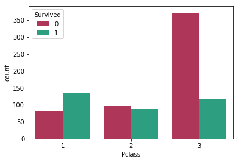


```python
sns.stripplot(x='Pclass',y='Age',data=train,hue='IsAlone',jitter=True)
```


    <matplotlib.axes._subplots.AxesSubplot at 0x26840bd6a20>


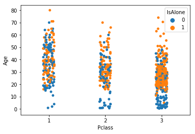


## Categorical Columns


```python
train = pd.get_dummies(train, columns=['Embarked'])
test = pd.get_dummies(test, columns=['Embarked'])  

```


```python
train['Sex'] = train['Sex'].map( {'female': 0, 'male': 1} ).astype(int)
test['Sex'] = test['Sex'].map( {'female': 0, 'male': 1} ).astype(int)
```

## Binning

Here, I split the Fare and Age columns to bins based on value. I can also create quantile bins using the pd.qcut function but I found better results based on value.


```python
train['FareBucket'] = (train['Fare']/50).astype(int)
test['FareBucket'] = (test['Fare']/50).astype(int)
```


```python
train['AgeBand'] = (train['Age']/5).astype(int)
test['AgeBand'] = (test['Age']/5).astype(int)
```


```python
train.drop(['Age','Fare','PassengerId','Name','SibSp','Parch'], axis =1, inplace=True)
test.drop(['Age','Fare','Name','SibSp','Parch'], axis = 1, inplace=True)
```


```python
p = sns.pairplot(train[['Survived', 'Pclass', 'Sex', 'FamilySize', 'FareBucket','AgeBand', 'IsAlone']],hue='Survived', diag_kind = 'kde',palette= {1: "#1ab188", 0: "#c22250"} )
p.set(xticklabels=[])
```


    <seaborn.axisgrid.PairGrid at 0x26840c3aa90>


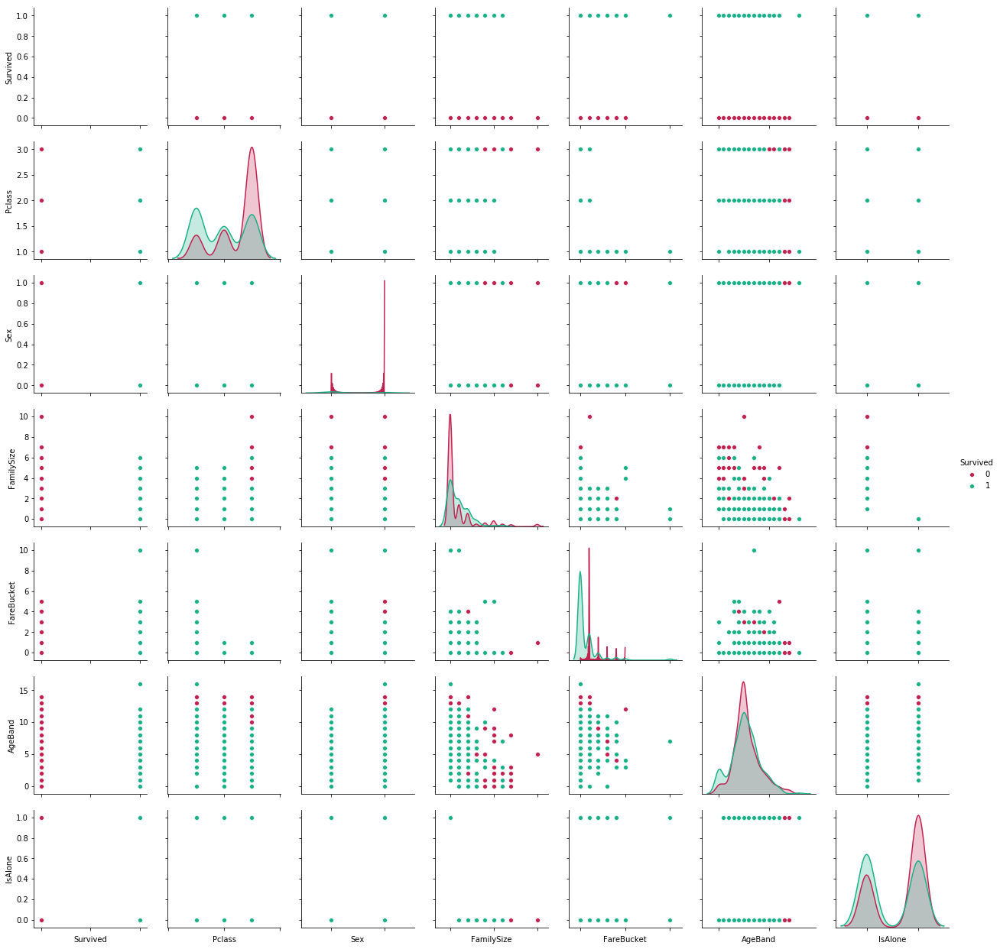


```python
plt.figure(figsize=(14,10))
sns.heatmap(train.corr(),annot=True)
```


    <matplotlib.axes._subplots.AxesSubplot at 0x2684390cf60>


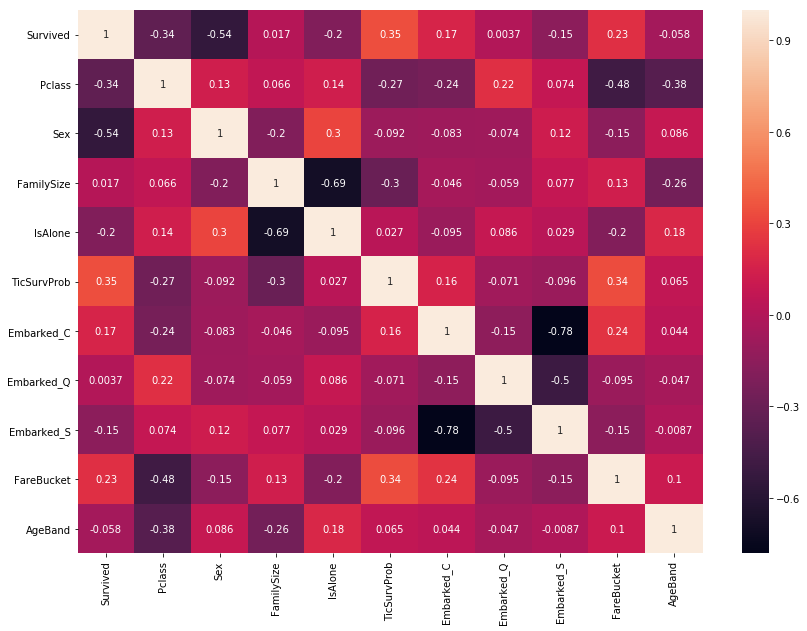


The column 'Sex' has the highest correlation with Survived followed by 'TicSurvProb'.


```python
pd.DataFrame(train.corr()['Survived']).abs().sort_values('Survived',ascending=False)
```


<div>
<style scoped>
    .dataframe tbody tr th:only-of-type {
        vertical-align: middle;
    }

    .dataframe tbody tr th {
        vertical-align: top;
    }

    .dataframe thead th {
        text-align: right;
    }
</style>
<table border="1" class="dataframe">
  <thead>
    <tr style="text-align: right;">
      <th></th>
      <th>Survived</th>
    </tr>
  </thead>
  <tbody>
    <tr>
      <th>Survived</th>
      <td>1.000000</td>
    </tr>
    <tr>
      <th>Sex</th>
      <td>0.543351</td>
    </tr>
    <tr>
      <th>TicSurvProb</th>
      <td>0.345087</td>
    </tr>
    <tr>
      <th>Pclass</th>
      <td>0.338481</td>
    </tr>
    <tr>
      <th>FareBucket</th>
      <td>0.225942</td>
    </tr>
    <tr>
      <th>IsAlone</th>
      <td>0.203367</td>
    </tr>
    <tr>
      <th>Embarked_C</th>
      <td>0.168240</td>
    </tr>
    <tr>
      <th>Embarked_S</th>
      <td>0.149683</td>
    </tr>
    <tr>
      <th>AgeBand</th>
      <td>0.057515</td>
    </tr>
    <tr>
      <th>FamilySize</th>
      <td>0.016639</td>
    </tr>
    <tr>
      <th>Embarked_Q</th>
      <td>0.003650</td>
    </tr>
  </tbody>
</table>
</div>


Insert x and y


```python
from sklearn.model_selection import train_test_split
X = train.drop(['Survived'],axis=1)
y = train['Survived']

```

## Stacking

I will use the entire train data to perform Cross Validation. I may get better results with KNN and SVC if I scale the data but I have skipped that step.


```python
from sklearn.model_selection import KFold 
from sklearn.ensemble import ExtraTreesClassifier
from sklearn.ensemble import AdaBoostClassifier, GradientBoostingClassifier
from sklearn.linear_model import LogisticRegression
from sklearn.svm import SVC
from sklearn.neighbors import KNeighborsClassifier
from sklearn.naive_bayes import MultinomialNB
from sklearn.model_selection import cross_val_score
import xgboost as xgb
import warnings
warnings.filterwarnings('ignore')
num_of_estimators = 500
rfClass = RandomForestClassifier(n_estimators=200,max_depth=3,
                                 min_samples_leaf= 1,max_features=5,min_samples_split=3,criterion='entropy')
logClass = LogisticRegression(penalty='l1',C=21.544346900318832)
svcClass = SVC(gamma=0.001,C=10)
knnClass = KNeighborsClassifier(n_neighbors=9)
xgbClass = xgb.XGBClassifier(n_estimators=100,colsample_bytree= 0.8, gamma=1, max_depth=5, min_child_weight=1, subsample=1.0)
nbClass = MultinomialNB()
adaClass = AdaBoostClassifier(n_estimators=20,learning_rate=0.2)
extraTreesClass = ExtraTreesClassifier(n_estimators=50,bootstrap=False,criterion='entropy',max_features=3,min_samples_leaf=3,
                                        min_samples_split=10,max_depth=None)
gradientBClass = GradientBoostingClassifier(n_estimators=20,max_depth=3,max_features= 5,min_samples_leaf=3,min_samples_split=2)
```

## Stacking


```python
#Build base models
```


```python
len(X) #Length before splitting:891 Source - Coursera Advanced ML
```


    891


I will divide the training data set into 3 subsets - s_train, s_valid and s_test. s_train will be used to train the base models. I will use these base models to make predictions on the s_valid dataset. I will then make a data frame of all the predictions and this will server as the training data to the meta model. s_test will be used to test the model.

Divide into train and a temporary test set


```python
X_s_train, X_s_test2, y_s_train, y_s_test2 = train_test_split(X, y, test_size=0.5)
```

Divide the temporary test set into validate and test


```python
X_s_valid, X_s_test, y_s_valid, y_s_test = train_test_split(X_s_test2, y_s_test2, test_size=0.1)
```


```python
print(len(X_s_train)) #length of Train: 534  (60%)
print(len(X_s_valid)) #length of Validate: 178 (20%)
print(len(X_s_test)) #length of Test: 179 (20%)
```

    445
    401
    45
    

Train the base models with s_train


```python
rfClass.fit(X_s_train,y_s_train)
adaClass.fit(X_s_train,y_s_train)
extraTreesClass.fit(X_s_train,y_s_train)
logClass.fit(X_s_train,y_s_train)
xgbClass.fit(X_s_train,y_s_train)
svcClass.fit(X_s_train,y_s_train)
knnClass.fit(X_s_train,y_s_train)
gradientBClass.fit(X_s_train,y_s_train)

#predict these models on validate data
vld_rfPred = rfClass.predict(X_s_valid)
vld_adaPred = adaClass.predict(X_s_valid)
vld_extPred = extraTreesClass.predict(X_s_valid)
vld_logPred = logClass.predict(X_s_valid)
vld_xgbPred = xgbClass.predict(X_s_valid)
vld_svcPred = svcClass.predict(X_s_valid)
vld_knnPred = knnClass.predict(X_s_valid)
vld_gbPred =  gradientBClass.predict(X_s_valid)
```


```python
base_predictions_train = pd.DataFrame( {
    'RandomForest': vld_rfPred,
    'AdaptiveBoost': vld_adaPred,
    'ExtraTrees': vld_extPred,
    'Log': vld_logPred,
    'XGB': vld_xgbPred,  
    'SVC': vld_svcPred,
    'KNN': vld_knnPred,
    'GB' : vld_gbPred,
    'Y': y_s_valid,
    })
base_predictions_train.head()
```


<div>
<style scoped>
    .dataframe tbody tr th:only-of-type {
        vertical-align: middle;
    }

    .dataframe tbody tr th {
        vertical-align: top;
    }

    .dataframe thead th {
        text-align: right;
    }
</style>
<table border="1" class="dataframe">
  <thead>
    <tr style="text-align: right;">
      <th></th>
      <th>RandomForest</th>
      <th>AdaptiveBoost</th>
      <th>ExtraTrees</th>
      <th>Log</th>
      <th>XGB</th>
      <th>SVC</th>
      <th>KNN</th>
      <th>GB</th>
      <th>Y</th>
    </tr>
  </thead>
  <tbody>
    <tr>
      <th>151</th>
      <td>1</td>
      <td>1</td>
      <td>1</td>
      <td>1</td>
      <td>1</td>
      <td>1</td>
      <td>1</td>
      <td>1</td>
      <td>1</td>
    </tr>
    <tr>
      <th>887</th>
      <td>1</td>
      <td>1</td>
      <td>1</td>
      <td>1</td>
      <td>1</td>
      <td>1</td>
      <td>0</td>
      <td>1</td>
      <td>1</td>
    </tr>
    <tr>
      <th>383</th>
      <td>1</td>
      <td>1</td>
      <td>1</td>
      <td>1</td>
      <td>1</td>
      <td>1</td>
      <td>1</td>
      <td>1</td>
      <td>1</td>
    </tr>
    <tr>
      <th>66</th>
      <td>1</td>
      <td>1</td>
      <td>1</td>
      <td>1</td>
      <td>1</td>
      <td>1</td>
      <td>0</td>
      <td>1</td>
      <td>1</td>
    </tr>
    <tr>
      <th>52</th>
      <td>1</td>
      <td>1</td>
      <td>1</td>
      <td>1</td>
      <td>1</td>
      <td>1</td>
      <td>1</td>
      <td>1</td>
      <td>1</td>
    </tr>
  </tbody>
</table>
</div>


```python
#Analyze Stack Result Begin
```


```python
def generateMatchScore(row):
    score =0
    if(row['AdaptiveBoost'] == row['Y']):
        score = score + 1
    if(row['ExtraTrees'] == row['Y']):
        score = score + 1
    if(row['KNN'] == row['Y']):
        score = score + 1
    if(row['Log'] == row['Y']):
        score = score + 1
    if(row['RandomForest'] == row['Y']):
        score = score + 1
    if(row['SVC'] == row['Y']):
        score = score + 1
    if(row['XGB'] == row['Y']):
        score = score + 1
    return score
        

```


```python
base_predictions_train['Score'] = base_predictions_train.apply(generateMatchScore, axis=1)
```


```python
base_predictions_train[base_predictions_train['Score'] ==1]
```


<div>
<style scoped>
    .dataframe tbody tr th:only-of-type {
        vertical-align: middle;
    }

    .dataframe tbody tr th {
        vertical-align: top;
    }

    .dataframe thead th {
        text-align: right;
    }
</style>
<table border="1" class="dataframe">
  <thead>
    <tr style="text-align: right;">
      <th></th>
      <th>RandomForest</th>
      <th>AdaptiveBoost</th>
      <th>ExtraTrees</th>
      <th>Log</th>
      <th>XGB</th>
      <th>SVC</th>
      <th>KNN</th>
      <th>GB</th>
      <th>Y</th>
      <th>Score</th>
    </tr>
  </thead>
  <tbody>
    <tr>
      <th>507</th>
      <td>0</td>
      <td>0</td>
      <td>0</td>
      <td>0</td>
      <td>0</td>
      <td>0</td>
      <td>1</td>
      <td>0</td>
      <td>1</td>
      <td>1</td>
    </tr>
    <tr>
      <th>512</th>
      <td>0</td>
      <td>0</td>
      <td>0</td>
      <td>0</td>
      <td>0</td>
      <td>0</td>
      <td>1</td>
      <td>0</td>
      <td>1</td>
      <td>1</td>
    </tr>
    <tr>
      <th>599</th>
      <td>0</td>
      <td>0</td>
      <td>0</td>
      <td>0</td>
      <td>0</td>
      <td>0</td>
      <td>1</td>
      <td>0</td>
      <td>1</td>
      <td>1</td>
    </tr>
    <tr>
      <th>423</th>
      <td>1</td>
      <td>1</td>
      <td>1</td>
      <td>1</td>
      <td>1</td>
      <td>1</td>
      <td>0</td>
      <td>1</td>
      <td>0</td>
      <td>1</td>
    </tr>
    <tr>
      <th>114</th>
      <td>1</td>
      <td>1</td>
      <td>1</td>
      <td>1</td>
      <td>0</td>
      <td>1</td>
      <td>1</td>
      <td>1</td>
      <td>0</td>
      <td>1</td>
    </tr>
    <tr>
      <th>224</th>
      <td>0</td>
      <td>0</td>
      <td>0</td>
      <td>0</td>
      <td>0</td>
      <td>0</td>
      <td>1</td>
      <td>0</td>
      <td>1</td>
      <td>1</td>
    </tr>
    <tr>
      <th>772</th>
      <td>1</td>
      <td>1</td>
      <td>1</td>
      <td>1</td>
      <td>1</td>
      <td>0</td>
      <td>1</td>
      <td>1</td>
      <td>0</td>
      <td>1</td>
    </tr>
    <tr>
      <th>248</th>
      <td>0</td>
      <td>0</td>
      <td>0</td>
      <td>0</td>
      <td>0</td>
      <td>0</td>
      <td>1</td>
      <td>0</td>
      <td>1</td>
      <td>1</td>
    </tr>
    <tr>
      <th>182</th>
      <td>1</td>
      <td>1</td>
      <td>0</td>
      <td>1</td>
      <td>1</td>
      <td>1</td>
      <td>1</td>
      <td>1</td>
      <td>0</td>
      <td>1</td>
    </tr>
    <tr>
      <th>854</th>
      <td>1</td>
      <td>1</td>
      <td>1</td>
      <td>1</td>
      <td>1</td>
      <td>1</td>
      <td>0</td>
      <td>1</td>
      <td>0</td>
      <td>1</td>
    </tr>
    <tr>
      <th>38</th>
      <td>1</td>
      <td>1</td>
      <td>1</td>
      <td>1</td>
      <td>1</td>
      <td>1</td>
      <td>0</td>
      <td>1</td>
      <td>0</td>
      <td>1</td>
    </tr>
    <tr>
      <th>617</th>
      <td>1</td>
      <td>1</td>
      <td>1</td>
      <td>1</td>
      <td>0</td>
      <td>1</td>
      <td>1</td>
      <td>1</td>
      <td>0</td>
      <td>1</td>
    </tr>
    <tr>
      <th>690</th>
      <td>0</td>
      <td>0</td>
      <td>0</td>
      <td>0</td>
      <td>0</td>
      <td>0</td>
      <td>1</td>
      <td>0</td>
      <td>1</td>
      <td>1</td>
    </tr>
    <tr>
      <th>447</th>
      <td>0</td>
      <td>0</td>
      <td>0</td>
      <td>0</td>
      <td>0</td>
      <td>0</td>
      <td>1</td>
      <td>0</td>
      <td>1</td>
      <td>1</td>
    </tr>
    <tr>
      <th>18</th>
      <td>1</td>
      <td>1</td>
      <td>1</td>
      <td>1</td>
      <td>0</td>
      <td>1</td>
      <td>1</td>
      <td>1</td>
      <td>0</td>
      <td>1</td>
    </tr>
  </tbody>
</table>
</div>


```python
sns.heatmap(base_predictions_train.corr(),annot=True)
```


    <matplotlib.axes._subplots.AxesSubplot at 0x268444a0c50>


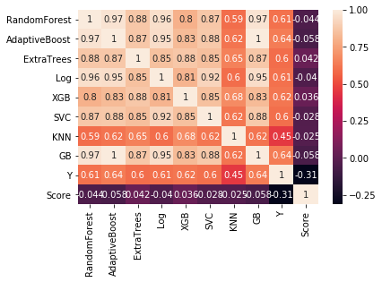


```python
#Concatenate all predictions on Validate
stacked_valid_predictions = np.column_stack((vld_rfPred, vld_adaPred, vld_extPred,vld_logPred,vld_xgbPred,
                                             vld_svcPred,vld_knnPred,vld_gbPred))
```

Create meta model


```python
meta_model = xgb.XGBClassifier(n_estimators=90,colsample_bytree=0.8, gamma=5, max_depth=3,
                                      min_child_weight=10, subsample=0.6)
```

Fit meta model on Validate subset


```python
meta_model.fit(stacked_valid_predictions,y_s_valid)
```


    XGBClassifier(base_score=0.5, booster='gbtree', colsample_bylevel=1,
           colsample_bytree=0.8, gamma=5, learning_rate=0.1, max_delta_step=0,
           max_depth=3, min_child_weight=10, missing=None, n_estimators=90,
           n_jobs=1, nthread=None, objective='binary:logistic', random_state=0,
           reg_alpha=0, reg_lambda=1, scale_pos_weight=1, seed=None,
           silent=True, subsample=0.6)


```python
feature_importances = pd.DataFrame(meta_model.feature_importances_,index = ['vld_rfPred', 'vld_adaPred', 'vld_extPred','vld_logPred','vld_xgbPred',
                                             'vld_svcPred','vld_knnPred','vld_gbPred'],columns=['importance']).sort_values('importance',   ascending=False)
feature_importances
```


<div>
<style scoped>
    .dataframe tbody tr th:only-of-type {
        vertical-align: middle;
    }

    .dataframe tbody tr th {
        vertical-align: top;
    }

    .dataframe thead th {
        text-align: right;
    }
</style>
<table border="1" class="dataframe">
  <thead>
    <tr style="text-align: right;">
      <th></th>
      <th>importance</th>
    </tr>
  </thead>
  <tbody>
    <tr>
      <th>vld_xgbPred</th>
      <td>0.384615</td>
    </tr>
    <tr>
      <th>vld_adaPred</th>
      <td>0.307692</td>
    </tr>
    <tr>
      <th>vld_svcPred</th>
      <td>0.115385</td>
    </tr>
    <tr>
      <th>vld_gbPred</th>
      <td>0.115385</td>
    </tr>
    <tr>
      <th>vld_extPred</th>
      <td>0.076923</td>
    </tr>
    <tr>
      <th>vld_rfPred</th>
      <td>0.000000</td>
    </tr>
    <tr>
      <th>vld_logPred</th>
      <td>0.000000</td>
    </tr>
    <tr>
      <th>vld_knnPred</th>
      <td>0.000000</td>
    </tr>
  </tbody>
</table>
</div>


Use Base Models to predict on s_test set


```python
tst_rfPred = rfClass.predict(X_s_test)
tst_adaPred = adaClass.predict(X_s_test)
tst_extPred = extraTreesClass.predict(X_s_test)
tst_logPred = logClass.predict(X_s_test)
tst_xgbPred = xgbClass.predict(X_s_test)
tst_svcPred = svcClass.predict(X_s_test)
tst_knnPred = knnClass.predict(X_s_test)
tst_gbPred = gradientBClass.predict(X_s_test)

#Concatenate base model predictions on Test
stacked_test_predictions = np.column_stack((tst_rfPred, tst_adaPred, tst_extPred,tst_logPred,tst_xgbPred,
                                           tst_svcPred,tst_knnPred,tst_gbPred))

```

Use the predictions from the above step as input to the meta model


```python
#Predict Test predictions using meta model 
s_test_pred = meta_model.predict(stacked_test_predictions)
```


```python
from sklearn.metrics import confusion_matrix,classification_report
print(classification_report(y_s_test,s_test_pred))
```

                 precision    recall  f1-score   support
    
              0       0.87      0.93      0.90        28
              1       0.87      0.76      0.81        17
    
    avg / total       0.87      0.87      0.86        45
    
    

 Predictions on Test Data for submission


```python
X_test = test.drop(['PassengerId'],axis=1)
```


```python
#Use the base models to make predictions on test set
t_rfPred = rfClass.predict(X_test)
t_adaPred = adaClass.predict(X_test)
t_extPred = extraTreesClass.predict(X_test)
t_logPred = logClass.predict(X_test)
t_xgbPred = xgbClass.predict(X_test)
t_svcPred = svcClass.predict(X_test)
t_knnPred = knnClass.predict(X_test)
t_gbPred = gradientBClass.predict(X_test)

#Concatenate base model predictions on Test
stacked_t_predictions = np.column_stack((t_rfPred, t_adaPred, t_extPred,t_logPred,t_xgbPred,t_svcPred,t_knnPred,t_gbPred))
#Use the meta model to make predictions on test set
final_pred = meta_model.predict(stacked_t_predictions)
```

Before we submit, lets check if the 4 remaining passengers of the Sage family survived


```python
tst_sageFamily
```


<div>
<style scoped>
    .dataframe tbody tr th:only-of-type {
        vertical-align: middle;
    }

    .dataframe tbody tr th {
        vertical-align: top;
    }

    .dataframe thead th {
        text-align: right;
    }
</style>
<table border="1" class="dataframe">
  <thead>
    <tr style="text-align: right;">
      <th></th>
      <th>PassengerId</th>
      <th>Pclass</th>
      <th>Name</th>
      <th>Sex</th>
      <th>Age</th>
      <th>SibSp</th>
      <th>Parch</th>
      <th>Ticket</th>
      <th>Fare</th>
      <th>Embarked</th>
      <th>FamilySize</th>
      <th>IsAlone</th>
    </tr>
  </thead>
  <tbody>
    <tr>
      <th>188</th>
      <td>1080</td>
      <td>3</td>
      <td>Sage, Miss. Ada</td>
      <td>female</td>
      <td>25.0</td>
      <td>8</td>
      <td>2</td>
      <td>CA. 2343</td>
      <td>69.55</td>
      <td>S</td>
      <td>10</td>
      <td>0</td>
    </tr>
    <tr>
      <th>342</th>
      <td>1234</td>
      <td>3</td>
      <td>Sage, Mr. John George</td>
      <td>male</td>
      <td>25.0</td>
      <td>1</td>
      <td>9</td>
      <td>CA. 2343</td>
      <td>69.55</td>
      <td>S</td>
      <td>10</td>
      <td>0</td>
    </tr>
    <tr>
      <th>360</th>
      <td>1252</td>
      <td>3</td>
      <td>Sage, Master. William Henry</td>
      <td>male</td>
      <td>14.5</td>
      <td>8</td>
      <td>2</td>
      <td>CA. 2343</td>
      <td>69.55</td>
      <td>S</td>
      <td>10</td>
      <td>0</td>
    </tr>
    <tr>
      <th>365</th>
      <td>1257</td>
      <td>3</td>
      <td>Sage, Mrs. John (Annie Bullen)</td>
      <td>female</td>
      <td>25.0</td>
      <td>1</td>
      <td>9</td>
      <td>CA. 2343</td>
      <td>69.55</td>
      <td>S</td>
      <td>10</td>
      <td>0</td>
    </tr>
  </tbody>
</table>
</div>


```python
submission = pd.DataFrame({
        "PassengerId": test["PassengerId"],
        "Survived": final_pred
    })

```


```python
submission.head()
```


<div>
<style scoped>
    .dataframe tbody tr th:only-of-type {
        vertical-align: middle;
    }

    .dataframe tbody tr th {
        vertical-align: top;
    }

    .dataframe thead th {
        text-align: right;
    }
</style>
<table border="1" class="dataframe">
  <thead>
    <tr style="text-align: right;">
      <th></th>
      <th>PassengerId</th>
      <th>Survived</th>
    </tr>
  </thead>
  <tbody>
    <tr>
      <th>0</th>
      <td>892</td>
      <td>0</td>
    </tr>
    <tr>
      <th>1</th>
      <td>893</td>
      <td>1</td>
    </tr>
    <tr>
      <th>2</th>
      <td>894</td>
      <td>0</td>
    </tr>
    <tr>
      <th>3</th>
      <td>895</td>
      <td>0</td>
    </tr>
    <tr>
      <th>4</th>
      <td>896</td>
      <td>1</td>
    </tr>
  </tbody>
</table>
</div>


```python
tst_sageFamily.head()
```


<div>
<style scoped>
    .dataframe tbody tr th:only-of-type {
        vertical-align: middle;
    }

    .dataframe tbody tr th {
        vertical-align: top;
    }

    .dataframe thead th {
        text-align: right;
    }
</style>
<table border="1" class="dataframe">
  <thead>
    <tr style="text-align: right;">
      <th></th>
      <th>PassengerId</th>
      <th>Pclass</th>
      <th>Name</th>
      <th>Sex</th>
      <th>Age</th>
      <th>SibSp</th>
      <th>Parch</th>
      <th>Ticket</th>
      <th>Fare</th>
      <th>Embarked</th>
      <th>FamilySize</th>
      <th>IsAlone</th>
    </tr>
  </thead>
  <tbody>
    <tr>
      <th>188</th>
      <td>1080</td>
      <td>3</td>
      <td>Sage, Miss. Ada</td>
      <td>female</td>
      <td>25.0</td>
      <td>8</td>
      <td>2</td>
      <td>CA. 2343</td>
      <td>69.55</td>
      <td>S</td>
      <td>10</td>
      <td>0</td>
    </tr>
    <tr>
      <th>342</th>
      <td>1234</td>
      <td>3</td>
      <td>Sage, Mr. John George</td>
      <td>male</td>
      <td>25.0</td>
      <td>1</td>
      <td>9</td>
      <td>CA. 2343</td>
      <td>69.55</td>
      <td>S</td>
      <td>10</td>
      <td>0</td>
    </tr>
    <tr>
      <th>360</th>
      <td>1252</td>
      <td>3</td>
      <td>Sage, Master. William Henry</td>
      <td>male</td>
      <td>14.5</td>
      <td>8</td>
      <td>2</td>
      <td>CA. 2343</td>
      <td>69.55</td>
      <td>S</td>
      <td>10</td>
      <td>0</td>
    </tr>
    <tr>
      <th>365</th>
      <td>1257</td>
      <td>3</td>
      <td>Sage, Mrs. John (Annie Bullen)</td>
      <td>female</td>
      <td>25.0</td>
      <td>1</td>
      <td>9</td>
      <td>CA. 2343</td>
      <td>69.55</td>
      <td>S</td>
      <td>10</td>
      <td>0</td>
    </tr>
  </tbody>
</table>
</div>


```python
#submission['PassengerId'] in tst_sageFamily['PassengerId']
tst_sageFamily.merge(submission,how='left',on='PassengerId')
```


<div>
<style scoped>
    .dataframe tbody tr th:only-of-type {
        vertical-align: middle;
    }

    .dataframe tbody tr th {
        vertical-align: top;
    }

    .dataframe thead th {
        text-align: right;
    }
</style>
<table border="1" class="dataframe">
  <thead>
    <tr style="text-align: right;">
      <th></th>
      <th>PassengerId</th>
      <th>Pclass</th>
      <th>Name</th>
      <th>Sex</th>
      <th>Age</th>
      <th>SibSp</th>
      <th>Parch</th>
      <th>Ticket</th>
      <th>Fare</th>
      <th>Embarked</th>
      <th>FamilySize</th>
      <th>IsAlone</th>
      <th>Survived</th>
    </tr>
  </thead>
  <tbody>
    <tr>
      <th>0</th>
      <td>1080</td>
      <td>3</td>
      <td>Sage, Miss. Ada</td>
      <td>female</td>
      <td>25.0</td>
      <td>8</td>
      <td>2</td>
      <td>CA. 2343</td>
      <td>69.55</td>
      <td>S</td>
      <td>10</td>
      <td>0</td>
      <td>0</td>
    </tr>
    <tr>
      <th>1</th>
      <td>1234</td>
      <td>3</td>
      <td>Sage, Mr. John George</td>
      <td>male</td>
      <td>25.0</td>
      <td>1</td>
      <td>9</td>
      <td>CA. 2343</td>
      <td>69.55</td>
      <td>S</td>
      <td>10</td>
      <td>0</td>
      <td>0</td>
    </tr>
    <tr>
      <th>2</th>
      <td>1252</td>
      <td>3</td>
      <td>Sage, Master. William Henry</td>
      <td>male</td>
      <td>14.5</td>
      <td>8</td>
      <td>2</td>
      <td>CA. 2343</td>
      <td>69.55</td>
      <td>S</td>
      <td>10</td>
      <td>0</td>
      <td>0</td>
    </tr>
    <tr>
      <th>3</th>
      <td>1257</td>
      <td>3</td>
      <td>Sage, Mrs. John (Annie Bullen)</td>
      <td>female</td>
      <td>25.0</td>
      <td>1</td>
      <td>9</td>
      <td>CA. 2343</td>
      <td>69.55</td>
      <td>S</td>
      <td>10</td>
      <td>0</td>
      <td>0</td>
    </tr>
  </tbody>
</table>
</div>


```python
submission.to_csv('titanic_output.csv', index=False)
```
